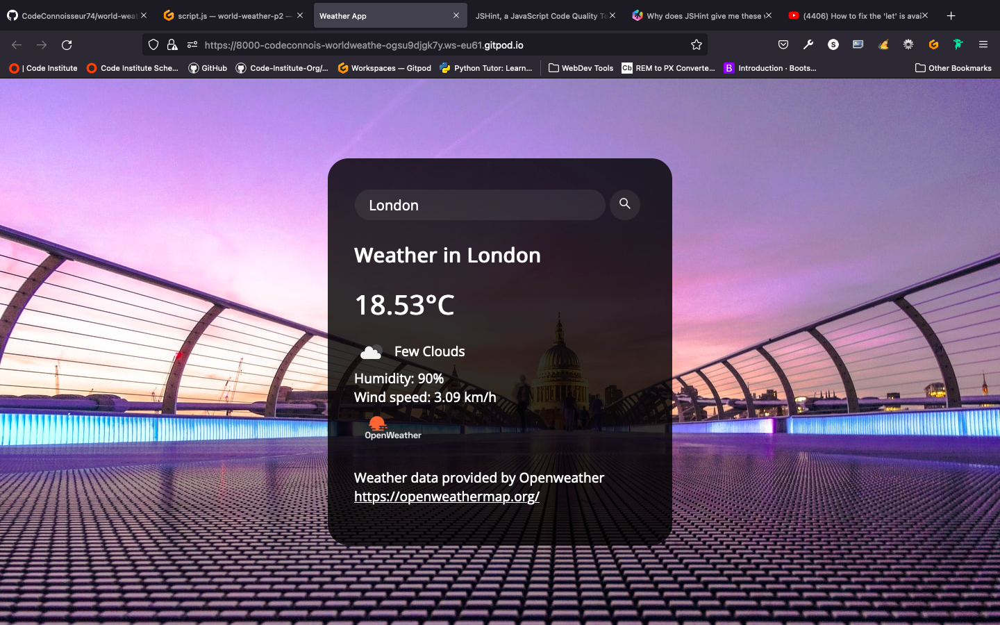
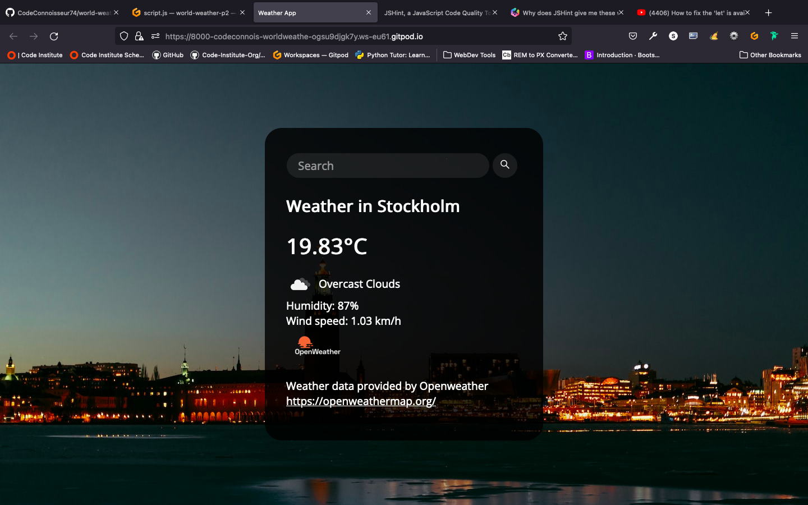
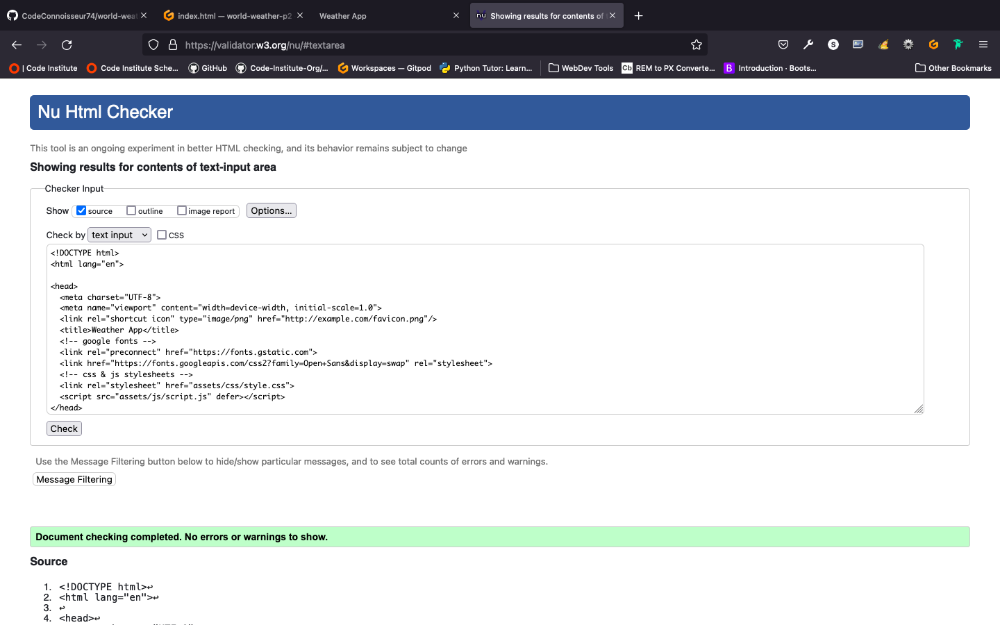
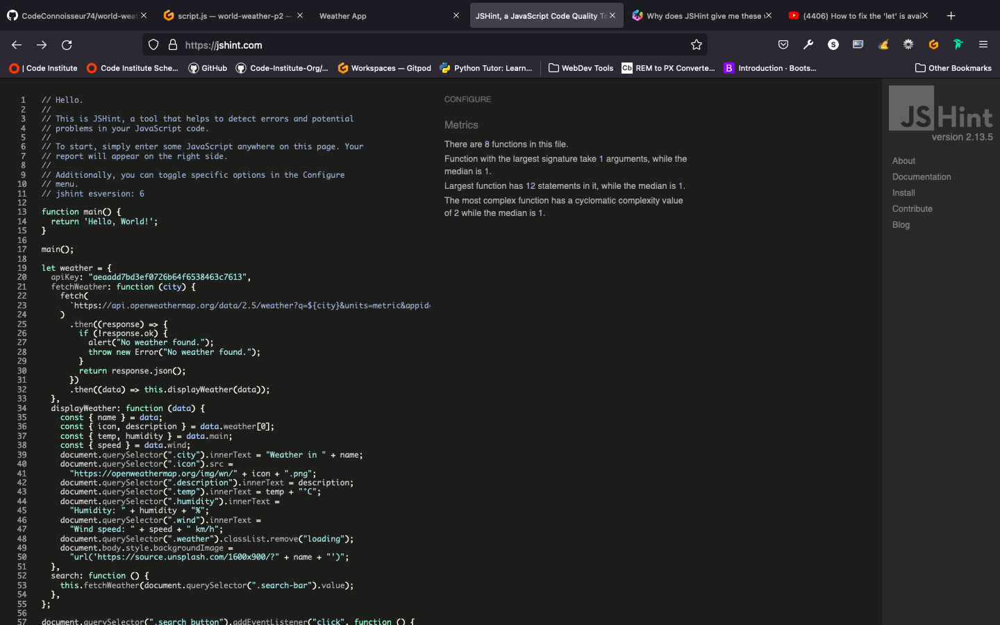
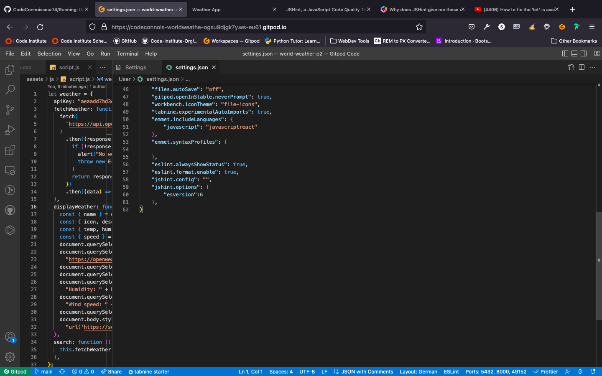

# **WORLD WEATHER**

[Link to Live Project](https://codeconnoisseur74.github.io/world-weather-p2/)

## Table of Contents
- [Introduction](#introduction)
- [UX](#ux)
  - [User Stories](#user-stories)
  - [Wireframes](#wireframes)
- [Features](#features)
  - [Existing Features](#existing-features)
  - [Features Left to Implement](#features-left-to-implement)
- [Technologies Used](#technologies-used)
  - [Languages Used](#languages-used)
  - [Frameworks, Libraries & Programs Used](#frameworks-libraries--programs-used)
- [Testing](#testing)
- [Deployment](#deployment)
  - [GitHub](#github-pages)
  - [Forking the GitHub Repository](#forking-the-github-repository)
  - [Cloning the GitHub Repository](#cloning-the-github-repository)
- [Credits](#credits)
  - [Code](#code)
  - [Content](#content)
  - [Media](#media)
  - [Other](#other)

## Introduction
World Weather is a weather website where the user can search for the current weather by city. The background image correspods with a random image of that city is fetched from unsplash.com. Current weather information includes: temprature in celcius, cloud status, humidity and windspeed. This weather data is fetched from openweatherapp.org. The site allows the user to quickly access current weather information of any major city worldwide whilst a corresponding image is provided to the user in realtime. The site is responsive to any size desktop, tablet or smartphone device. 

 
[The live project can be found here.]()
## UX

### User Stories

| ID | As a... | I Want To Be Able To... | So That I Can...|
| --- | --- | --- | --- |
| 01 | As a traveler | quick access to weather in major cities | can quickly receive up to date weather forecasts for quick and easy travel planning. |
| 02 | young user | access quick weather info | enjoying the random images that appear in realtime for major cities around the world I hope to visit one day. |
| 03 | office manager| using the website on the plasma screen in the lounge of the office | esthetically pleasing image of local city with current weather conditions |

## Features

### Current Weather Data
* User can search for current weather in any major city in the world. 
* Weather data includes:  temprature in celcius, cloud status, humidity and windspeed.

#### Random image of current city 

* the city that is searched, will bring up a random image from unsplash. com along with the weather information corresponding with the city choice. 

#### Current Weather Data

* Current weather data is displayed showing: tempraturein celcius, cloud status, windspeed and humidity. 
* Weather Data is current and a quick refresh of the browser updates the weather data for chosen city through the search option.

### Features Left to Implement

* The feature to automatically refresh weather data for selected city so the user does not have to manually refresh the browser in order to update the current weather data. 

## Technologies Used

### Languages Used
* [HTML5](https://en.wikipedia.org/wiki/HTML5), [CSS3](https://en.wikipedia.org/wiki/CSS), [JavaScript](https://en.wikipedia.org/wiki/JavaScript)

### Frameworks, Libraries & Programs Used

* [Bootstrap 5.2](https://getbootstrap.com/docs/5.2/getting-started/introduction/) has been used to assist with the styling of the site and particularly the responsiveness.
* [Node.js](https://nodejs.org/en/) has been used to assist JavaScript with implimentation of the website capabilities to fetch and recieve weather data and corresponding images on the website. 
* [OpenWeatherMap](https://openweathermap.org/guide) has been used to create the API Access Key and API in order to fetch current weather data.
* [Unsplash](https://unsplash.com/documentation#list-collections) has been used to provide the Corresponding City images for the website. 
* [The W3C Markup Validator](https://validator.w3.org/#validate_by_input) has been used to validate the html code.
* [The W3C Jigsaw CSS Validator](https://jigsaw.w3.org/css-validator/) has been used to validate the CSS code. 
* [JShint](https://jshint.com/) has been used to validate the JavaScript code.

## Testing

The W3C Markup Validator showed no errors when validating the html code. 

The W3C Jigsaw CSS Validator showed no errors when validating the CSS code.

The jsHint validator initially showed over 12 warnings regarding the validity of the JavaScript code. This was a known issue regarding the "ES6 version" in VScode. Updating the settings.JSON file in VS code rectified this. 

The JSHint then showed no errors when validating the JavaScript code. 

## Deployment

### GitHub Pages

The project was deployed to GitHub Pages. The following steps are used to deploy the site:
* Navigate to GitHub and locate and select the GitHub repository.
* Navigate to the settings tab and select the 'Pages' tab from the menu.
* Under 'Source' click the dropdown labelled 'None' and select the 'master' branch.
* Click save. The page will automatically refresh and the published site link can be found on the 'Pages' tab.
* The link can be found here - link to live site

### Forking the GitHub Repository

The following steps can be used to fork the GitHub repository:
* On GitHub navigate to the main page of the repository.
* The 'Fork' button can be found on the top righthand side of the screen.
* Click the button to create a copy of the original repository.

### Cloning the GitHub Repository

The following steps can be used to clone the GitHub repository:
* On GitHub navigate to the main page of the repository.
* Above the list of files select 'Code'.
* Three options are provided, HTTPS, SSH and GitHub CLI. Select the appropriate option and click the 'Copy' button next to the URL.
* Open Git Bash.
* Change the working directory to the location for the cloned directory.
* Type git clone and paste the copied URL.
* Press 'Enter' to create the clone.

## Credits

* R3HAB MEDIA youtube video on fixing the JS hint issue regarding the settings.JSON file.[YouTube](https://www.youtube.com/watch?v=QDzeU1FUZRk)

### Code

* [10 JavaScript project Ideas for beginners](https://www.makeuseof.com/javascript-beginner-project-ideas/)

### Content
* [GSStatic](https://fonts.gstatic.com) Icons and Font Styles.
* [Google Fonts](https://fonts.googleapis.com/css2?family=Open+Sans&display=swap)

### Media
* 
 [Unsplash](https://unsplash.com/documentation#list-collections)Screen Images, API and Access Key for fetching images that correspond with the User input of City search.
### Other

* [Ami I Responsive?](https://ui.dev/amiresponsive) Testing the Responsive design of the Website. 
